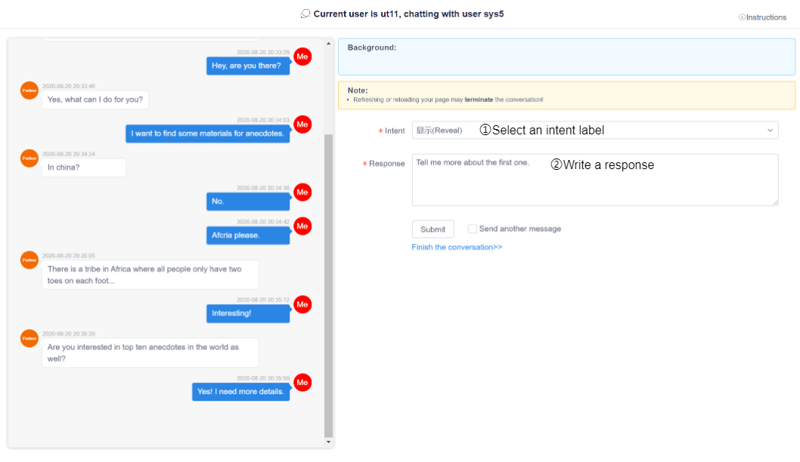
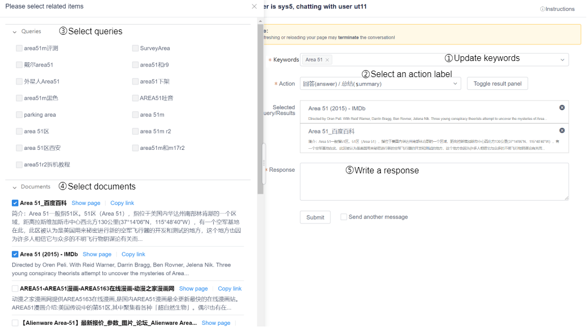

# CaSE UI: Next Steps

This repo contains the code for the UI used in the following paper:

>>@inproceedings{ren2021wizard,\
>>title={Wizard of Search Engine: Access to Information Through Conversations with Search Engines},\
>>author={Ren, Pengjie and Liu, Zhongkun and Song, Xiaomeng and Tian, Hongtao and Chen, Zhumin and Ren, Zhaochun and de Rijke, Maarten},\
>>booktitle={Proceedings of the 44th International ACM SIGIR Conference on Research and Development in Information Retrieval},\
>>year={2021}\
>>}
  



## Requirements

For the front end:
- Node.js
- NPM

For the back end:
- Java 8
- Maven

The database is MySQL 5.7.

For the proxy server:
- Python 3

## Usage

### Step 1. Database

Start the MySQL server. Note for later:
- root username
- root password
- port on which the db server is available

Here is one possible way, if you have Docker:

```shell
mkdir db

docker run --name chat-labelling-mysql -v $PWD/db:/var/lib/mysql -e MYSQL_ROOT_PASSWORD=my-secret-pw -p 3306:3306 -d mysql
```

If you'd like to connect to the MySQL monitor and explore the databse contents:

```shell
docker exec -ti chat-labelling-mysql mysql -u root -p
```

Enter the password for the root db user. Then inside MySQL shell:

```sql
use chat_labelling;
show tables;
select name,password,role from user;
```

### Step 2. Front end

Start the front end application.

**Option 1: Development Mode**

```shell
cd chat-labelling-frontend

npm install
npm run dev
```

**Option 2: Production Mode**

```shell
cd chat-labelling-frontend

npm install
npm run build

cp -r ./dist ../chat-labelling-backend/src/main/resources/static
```

### Step 3. Proxy server

If you want to want to log in as the 'sys' user, start the proxy server.

```shell
cd chat-labelling-proxy-server

source venv/bin/activate
source .env
python proxy.py
```

### Step 4. Back end

Start the back end application.

**Option 1: Development Mode**

```shell
cd chat-labelling-backend

source .env
mvn spring-boot:run
```

**Option 2: Production Mode**

```shell
cd chat-labelling-backend

mvn clean package -D maven.test.skip=true

java -jar target/chat-labelling-0.0.1-SNAPSHOT.war \
   --dbHost=localhost \
   --dbPort=3306 \
   --dbUser=root \
   --dbPass=my-secret-pw \
   --actionFile=$PWD/../resources/action.json \
   --backgroundFile=$PWD/../resources/background.json \
   --instructionFile=$PWD/../resources/instructions.html \
   --searchResultConfigFile=$PWD/../resources/searchResultConfig.json \
   --serverPort=9090
```
   
#### Regarding demo resource files

+ Demo action file and background file are in `/resources`
+ You can change the actions and backgrounds as you like
+ You can **not** modify the json keys or json structure of the file.
+ `instruction.html` is the instruction file shown on the user interface, you can change it as you like.
+ `searchResultConfig.json` is for configure which results are available for which actions.

#### Modify system status

+ Background index and labelling turn can be modified, and will be available when a new conversation is needed.
+ Wait seconds is the waiting duration when one of the conversation partner is offline. it can be modified and will be available immediately. (users already waiting for partner will not be affected)
+ Delete all system status, and restart the system, the all values will be set to default
